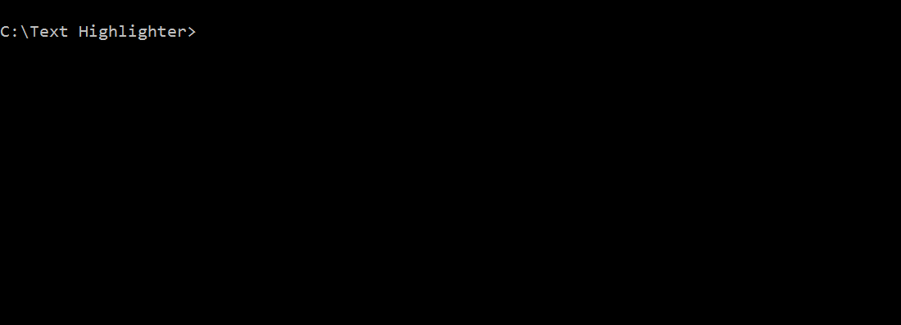

# Text Highlighter #

Den här uppgiften går ut på att skriva ett program som läser in en textfil, söker igenom textfilen efter en substräng, och skriver ut textfilens innehåll i terminalen, och i utskriften är substrängen "highlightad".

Programmet kommer ta filens namn, och den eftsökta substrängen som argument från kommandoprompten.

I fortsättningen kommer vi använda begreppet `haystack`för texten man söker i, och `needle `för det man söker efter.

Du skall skriva fyra funktioner: 

* `main`som inte tar några argument, men som använder `ARGV` för att skicka data till de andra funktionerna.
* ` read_file` som tar ett filnamn **som argument** och **returnerar**  en `String` med alla tecken i filen.
* `indices`som tar`needle` och `haystack` **som argument** och **returnerar** en `Array` med "startindex" för alla förekomster av `needle` i `haystack`.
* `print_highlighted_text`som tar `haystack`och listan av "startindex" **som argument**, och **skriver ut** texten i terminalen, där varje förekomst av `needle` är "highlightad"

### Highlighting ###

För att kunna "hightlighta" text i terminalen behöver du först installera [`colorize`-gemen](https://github.com/fazibear/colorize):

```cmd
gem install colorize
```

För att skriva ut text med en viss färg använder man sen:

```ruby
my_string = "grillkorv"
print my_string.blue #skriver ut strängen med blå text
print my_string.on_blue #skriver ut strängen på blå bakgrund
```

### Exempel ###




### Flödesschema ###

Innan du börjar koda ska du skapa ett flödesschema per funktion.

Testa flödesschemat med penna och papper


### *Obligatorisk* bonusbana ###

Dokumentera er kod enligt [TomDoc-standarden](http://tomdoc.org/)

Använd undantagshantering för att ta hand om eventuella undantag som kan uppstå.

Avkommentera bonusbane-testet för att kolla att er implementering fungerar


### Länkar ###

* [Alvin Alexander.com - How to process every line in a text file with Ruby](http://alvinalexander.com/blog/post/ruby/how-process-line-text-file-ruby)
* [Stack OverFlow - What are all the common ways to read a file in Ruby?](http://stackoverflow.com/questions/5545068/what-are-all-the-common-ways-to-read-a-file-in-ruby)
* [CodeAcacdemy - Ruby: Command Line Arguments with ARGV](https://www.codecademy.com/articles/ruby-command-line-argv)
* [TomDoc](http://tomdoc.org/)
* [Honebadger.io - A Beginner's Guide to Exceptions in Ruby](http://blog.honeybadger.io/a-beginner-s-guide-to-exceptions-in-ruby/)
